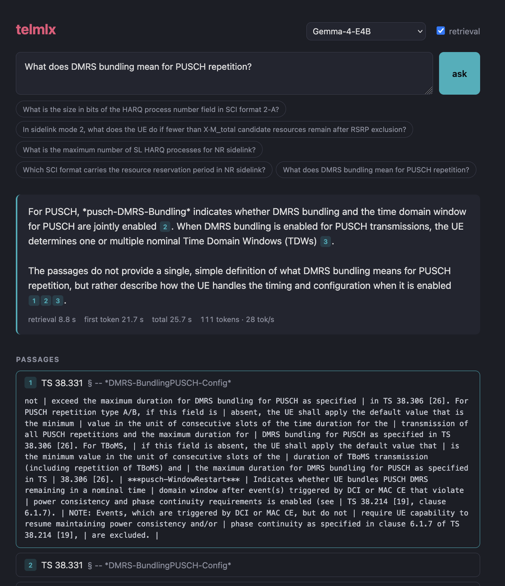

# telmlx

telmlx is a local retrieval augmented generation stack intended for helping through dense 3GPP and other telecom related documents. It is designed to run entirely on an Apple silicon Mac using `mlx_lm`. Please do note that this is a proof-of-concept project! (requires a bit of rewrite)

## Architecture

The stack consists of three MLX models on Apple silicon:
- **EmbeddingGemma-300M** for retrieval (FAISS index)
- **Qwen3-Reranker-0.6B** to rerank passages
- **Gemma-4-E4B** or **OTel-LLM-E4B-IT** to answer

Together they take about 6 GB of memory. On an M4 with 24 GB VRAM, retrieval takes about 1.5 s and the answer streams in at 30 tokens/s.

```text
question ──▶ EmbeddingGemma ──▶ FAISS (93k chunks) ──▶ Qwen3-Reranker ──▶ top passages (+ neighbours)
                                                                                 │
browser ◀── streamed answer with [n] citations ◀── mlx_lm.server (Gemma-4-E4B) ◀─┘
```

- `rag/chunk.py` splits the specs into ~350-word chunks per clause, keeping the latest release. The corpus in use here is the 38-series markdown from TSpec-LLM.
- `rag/build_index.py` embeds every chunk with EmbeddingGemma and writes a FAISS index.
- `rag/proxy.py` is a FastAPI server. It does the retrieval and forwards an OpenAI-style chat request with the context prepended.
- `ui/` is a single React + TypeScript page

## Performance

Closed-book, on the GSMA ot-lite benchmarks:

|                     | TeleQnA (1000) | Standards specs subset (200) | TeleTables (100) | 3GPP-TSG (100)           |
| ------------------- | -------------- | ---------------------------- | ---------------- | ------------------------ |
| Gemma-4-E4B (stock) | **0.679**      | 0.515                        | **0.31**         | **0.25**                 |
| OTel-LLM-E4B-IT     | 0.610          | 0.485                        | 0.22             | 0.00 (abstains on 100 %) |


For my usecase I would prefer the Gemma-4-E4B (or if you're seeing this in the future, any new SLM model)

## Usage & Reproduce

```bash
uv sync && git submodule update --init
hf auth login                                  # TSpec-LLM is gated
python -c "from huggingface_hub import snapshot_download as s; s('rasoul-nikbakht/TSpec-LLM', repo_type='dataset', local_dir='data/tspec', allow_patterns=[f'3GPP-clean/Rel-{r}/38_series/*.md' for r in (17,18,19)])"
python rag/chunk.py data/tspec/3GPP-clean data/chunks.jsonl
python rag/build_index.py data/chunks.jsonl data/index     # ~2.5 h on an M4
cd ui && bun install && cd ..
scripts/demo.sh
```



## References
- [TSpec-LLM Dataset](https://huggingface.co/datasets/rasoul-nikbakht/TSpec-LLM)
- [GSMA Open-Telco Benchmark (ot-lite)](https://huggingface.co/datasets/GSMA/ot-lite)
- [Open Telco (OTel)](https://github.com/farbodtavakkoli/OTel)
- [EmbeddingGemma-300M](https://huggingface.co/mlx-community/embeddinggemma-300m-bf16)
- [Qwen3-Reranker-0.6B](https://huggingface.co/mlx-community/Qwen3-Reranker-0.6B-4bit)
- [Gemma-4-E4B](https://huggingface.co/mlx-community/gemma-4-e4b-it-4bit)
